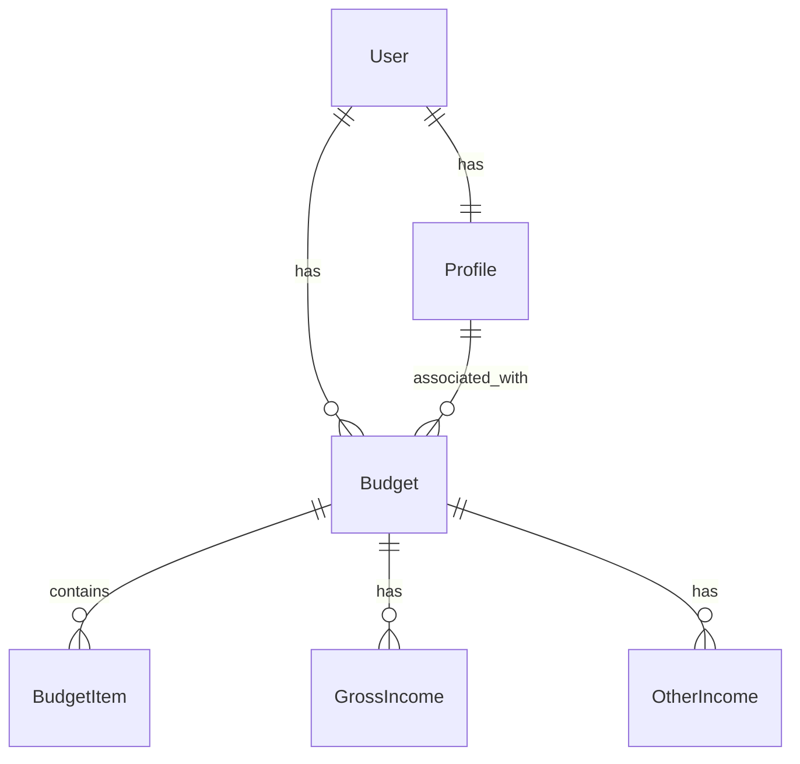

# Database Schema Documentation

## Overview
This document outlines the database schema for the Budget Application. The application uses PostgreSQL as its database and SQLAlchemy as the ORM.

## Models

### User
The core user model that handles authentication and user management.

```sql
Table: users
- id: Integer (Primary Key)
- username: String(20) (Unique, Not Null)
- email: String(120) (Unique, Not Null)
- password_hash: String(128) (Not Null)
- created_at: DateTime (Not Null, Default: now())
- is_admin: Boolean (Default: False)

Relationships:
- profile: One-to-One with Profile
- budgets: One-to-Many with Budget
```

### Profile
Stores user profile information including tax-related details.

```sql
Table: profiles
- id: Integer (Primary Key)
- user_id: Integer (Foreign Key -> users.id, Unique, Not Null)

Personal Information:
- first_name: String(50) (Not Null)
- last_name: String(50) (Not Null)
- date_of_birth: Date
- is_blind: Boolean (Default: False)
- is_student: Boolean (Default: False)

Location and Filing:
- state: String(2) (Not Null)
- filing_status: String(20) (Not Null, Default: "single")
- num_dependents: Integer (Default: 0)

Employment:
- income_type: String(20) (Not Null, Default: "Salary")
- pay_cycle: String(20) (Not Null)

Tax Withholdings:
- federal_additional_withholding: Float (Default: 0.0)
- state_additional_withholding: Float (Default: 0.0)

Retirement:
- retirement_contribution_type: String(10) (Not Null)
- retirement_contribution: Float (Default: 0.0)

Pre-tax Benefits:
- health_insurance_premium: Float (Default: 0.0)
- hsa_contribution: Float (Default: 0.0)
- fsa_contribution: Float (Default: 0.0)
- other_pretax_benefits: Float (Default: 0.0)
- benefit_deductions: Float (Default: 0.0)

Relationships:
- user: One-to-One with User
- budgets: One-to-Many with Budget
```

### Budget
Represents a user's budget with income and expense tracking.

```sql
Table: budgets
- id: Integer (Primary Key)
- user_id: Integer (Foreign Key -> users.id, Not Null)
- profile_id: Integer (Foreign Key -> profiles.id, Not Null)
- name: String(100) (Not Null)
- gross_income: Float (Not Null, Default: 0.0)
- retirement_contribution: Float (Default: 0)
- benefit_deductions: Float (Default: 0)
- status: String(20) (Not Null, Default: "draft")
- created_at: DateTime (Not Null, Default: now())
- updated_at: DateTime (Not Null, Default: now(), OnUpdate: now())

Constraints:
- Unique constraint on (user_id, name)

Relationships:
- user: Many-to-One with User
- profile: Many-to-One with Profile
- budget_items: One-to-Many with BudgetItem
- gross_income_sources: One-to-Many with GrossIncome
- other_income_sources: One-to-Many with OtherIncome
```

### BudgetItem
Represents individual expense items within a budget.

```sql
Table: budget_items
- id: Integer (Primary Key)
- budget_id: Integer (Foreign Key -> budgets.id, Not Null)
- category: String(50) (Not Null)
- name: String(50) (Not Null)
- minimum_payment: Float (Not Null)
- preferred_payment: Float (Not Null)

Relationships:
- budget: Many-to-One with Budget
```

### GrossIncome
Tracks different sources of gross income for a budget.

```sql
Table: gross_income
- id: Integer (Primary Key)
- budget_id: Integer (Foreign Key -> budgets.id, Not Null)
- category: String(50) (Not Null)
- source: String(100) (Not Null)
- gross_income: Float (Not Null)
- frequency: String(20) (Not Null)
- tax_type: String(50) (Not Null)
- state_tax_ref: String(2)
- created_at: DateTime (Not Null, Default: now())

Relationships:
- budget: Many-to-One with Budget
```

### OtherIncome
Tracks additional income sources for a budget.

```sql
Table: other_income
- id: Integer (Primary Key)
- budget_id: Integer (Foreign Key -> budgets.id, Not Null)
- category: String(50) (Not Null)
- source: String(100) (Not Null)
- amount: Float (Not Null)
- frequency: String(20) (Not Null)
- created_at: DateTime (Not Null, Default: now())

Relationships:
- budget: Many-to-One with Budget
```

## Relationships Overview



## Notes
- All monetary values are stored as Float type
- Timestamps use server-side `now()` function for consistency
- Cascading deletes are implemented where appropriate
- Foreign key constraints ensure data integrity 